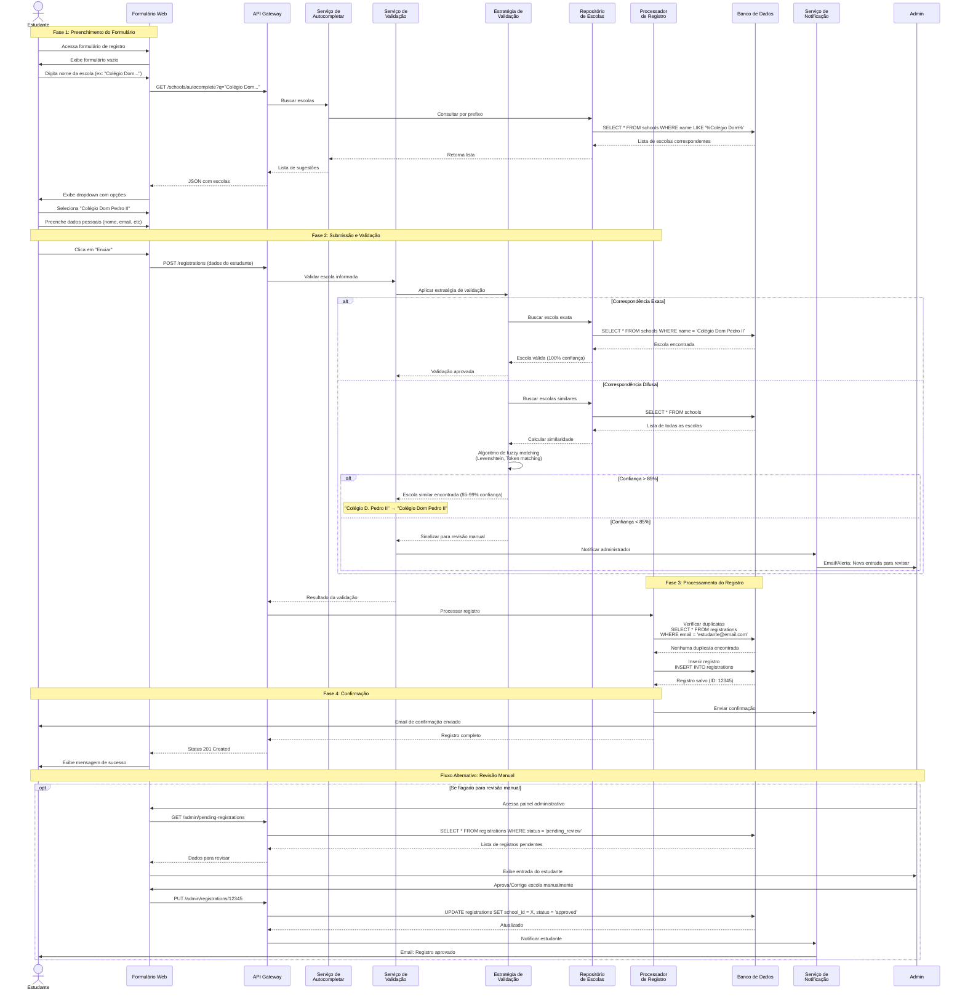

## Problemas relatados pelos stakeholders

- Falta de validações dos campos utilizados para realizar inscrições
- Retrabalho manual em fazer curadoria dos incritos para agrega-los por mentor e escola
- Falta de confirmação de que o email utilizado é válido
- Falta de controle para evitar inscrições duplicadas

## Solução Proposta

Como os stakeholders relataram mais dificuldades com relação a consistência geral dos dados das inscrições, tomamos como decisão focar nessa parte no decorrer da realização do trabalho e da disciplina. Uma vez que, também, os fornecedores desses requisitos possuem uma aplicação front-end já bem estruturada.

### Proposta inicial de arquitetura do sistema

```mermaid
graph TB
    subgraph "Interface do Estudante"
        A[Formulário de Registro]
        A1[Campo de Escola<br/>com Autocompletar]
        A2[Informações Pessoais]
        A3[Botão Enviar]
    end

    subgraph "Serviços da API"
        B[API de Autocompletar]
        C[API de Registro]
        D[API de Validação<br/>de Escola]
    end

    subgraph "Lógica de Validação"
        E{Gerenciador de<br/>Estratégia de Validação}
        F[Validador de<br/>Correspondência Exata]
        G[Validador de<br/>Correspondência Difusa]
        H[Sinalizar para<br/>Revisão Manual]
    end

    subgraph "Processamento de Dados"
        I[Repositório de Escolas]
        J[Processador de Registro]
        K[Verificador de Duplicatas]
        L[Correspondente de Escolas]
    end

    subgraph "Banco de Dados"
        M[(Registro de<br/>Escolas Válidas)]
        N[(Registros de<br/>Estudantes)]
    end

    subgraph "Notificações"
        O[E-mail de Sucesso]
        P[Alerta para Admin<br/>Revisão Manual]
    end

    A --> A1
    A --> A2
    A --> A3
    
    A1 -->|Digita Nome da Escola| B
    B --> I
    I -->|Consulta Escolas| M
    M -->|Retorna Correspondências| B
    B -->|Exibe Opções| A1
    
    A3 -->|Envia Formulário| C
    C -->|Valida Escola| D
    
    D --> E
    E -->|Verifica Escola| F
    E -->|Se Não Houver Correspondência Exata| G
    E -->|Se Incerto| H
    
    F -->|Escola Válida| I
    G -->|Escola Similar Encontrada| I
    G -->|Pontuação de Confiança| E
    H -->|Sinaliza Entrada| P
    
    I --> M
    
    C --> J
    J --> K
    K -->|Verifica Duplicata| N
    J --> L
    L -->|Corresponde com Escola| M
    
    J -->|Salva Registro| N
    N -->|Sucesso| O
    
    O -.->|E-mail Enviado| A
    P -.->|Admin Notificado| Admin[Painel do Administrador]
    
    style A fill:#e1f5ff
    style A1 fill:#b3e0ff
    style E fill:#fff4e1
    style F fill:#fff4e1
    style G fill:#fff4e1
    style H fill:#ffcccc
    style M fill:#d4edda
    style N fill:#d4edda
    style O fill:#d1ecf1
    style P fill:#f8d7da
```

### Diagrama de sequeência correspondente a tal arquitetura

[Link do primeiro protótipo](https://preview--olimpiada-ia-inscricao.lovable.app)
